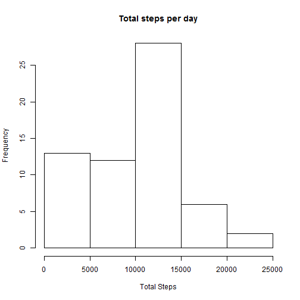
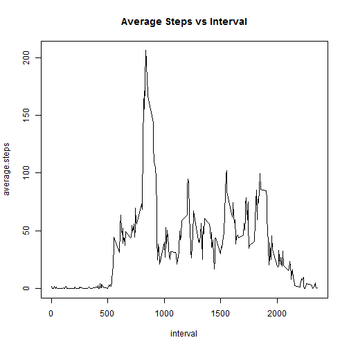
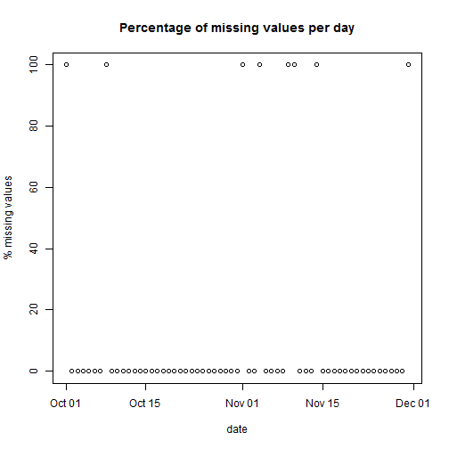
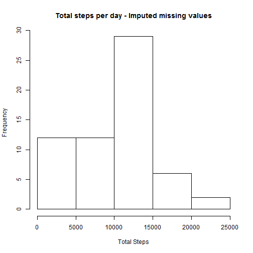
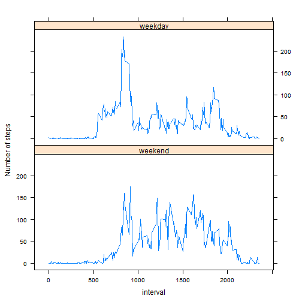

## Loading and preprocessing the data


```r
unzip("activity.zip")
df<-read.csv("activity.csv")
df$date <-  as.Date(as.character(df$date), "%Y-%m-%d")

str(df)
```

```
## 'data.frame':	17568 obs. of  3 variables:
##  $ steps   : int  NA NA NA NA NA NA NA NA NA NA ...
##  $ date    : Date, format: "2012-10-01" "2012-10-01" ...
##  $ interval: int  0 5 10 15 20 25 30 35 40 45 ...
```

## What is mean total number of steps taken per day?

Let's us now calculate the total number of steps taken per day.


```r
library(dplyr)
df_ts <- df%>%
        group_by(date)%>%
        summarize(total.steps = sum(steps,na.rm=T))
```
We can now visualize the result using a histogram

```r
hist(df_ts$total.steps, main = "Total steps per day", xlab = "Total Steps")
```

 

The average number of steps taken per day is 

```r
mean(df_ts$total.steps)
```

```
## [1] 9354.23
```

And the median is 

```r
median(df_ts$total.steps)
```

```
## [1] 10395
```

## What is the average daily activity pattern?
To visualize average daily activity pattern we shall plot the average number of steps taken, averaged across all days, vs 5-minute intervals, which correlate to the time during the day. 


```r
df_int <- df%>%
        group_by(interval)%>%
        summarize(average.steps = mean(steps,na.rm=T))
plot(df_int, type ="l", main = "Average Steps vs Interval")
```

 

The 5-minute interval which contains the maximum number of steps is 

```r
df_int$interval[which.max(df_int$average.steps)]
```

```
## [1] 835
```

At this interval 206.17 steps were taken on average.

## Imputing missing values

The original dataset includes 2304 missing values.


```r
sum(!complete.cases(df))
```

```
## [1] 2304
```

To better understand how missing values are distributed in the dataset we can build the following plot

```r
df_mv <- df%>%
     group_by(date)%>%
     summarize(missing.v = sum(is.na(steps))/length(steps)*100)
plot(df_mv, main = "Percentage of missing values per day", ylab = "% missing values")
```

 

We can see that the dataset has days with either full steps data (100%) or completely missing steps data (0%).
In order to impute missing values we shall use average values calculated across relevant 5-minute intervals from other days, such that days with missing data will look like "average" days.


```r
df1<-df
df1$steps[is.na(df1$steps)]<-df_int$average.steps[is.na(df1$steps)]
```

Now, let us visualize the new dataset using a histogram and compare it to the original dataset.


```r
df_ts <- df1%>%
        group_by(date)%>%
        summarize(total.steps = sum(steps,na.rm=T))

hist(df_ts$total.steps, main = "Total steps per day - Imputed missing values", xlab = "Total Steps")
```

 

Now the average number of steps taken per day is 

```r
mean(df_ts$total.steps)
```

```
## [1] 9530.724
```

And the new median is 

```r
median(df_ts$total.steps)
```

```
## [1] 10439
```

We can see that the average (and median) values of total steps taken per day are slightly larger than for the original dataset. It means that the days with average activity (calculated per each interval) have actually slightly more total steps than the average total number of steps calculated across all days.  

## Are there differences in activity patterns between weekdays and weekends?

Let's create a new factor variable in the dataset with two levels - "weekday" and "weekend" indicating whether a given date is a weekday or weekend day.


```r
wdays <- c('Monday', 'Tuesday', 'Wednesday', 'Thursday', 'Friday')
df1$wDay <- factor((weekdays(df1$date) %in% wdays), levels=c(FALSE, TRUE), labels=c('weekend', 'weekday') )

df_int <- df1%>%
        group_by(interval,wDay)%>%
        summarize(average.steps = mean(steps,na.rm=T))
```

Now we can make a panel plot showing average daily activity patterns separately for weekdays and weekends.


```r
library(lattice)
with(df_int, xyplot(average.steps~interval|wDay,type ="l",ylab = "Number of steps",layout = c(1,2)))
```

 

By inspecting this plot we can make a few observations
1. On average, weekdays activity starts earlier (most likely correlating to workday vs rest day routine)
2. On average, weekends activity is more evenly distributed over the time of the day as compared to weekdays (we may suggest active weekends vs "desk job" on weekdays)

